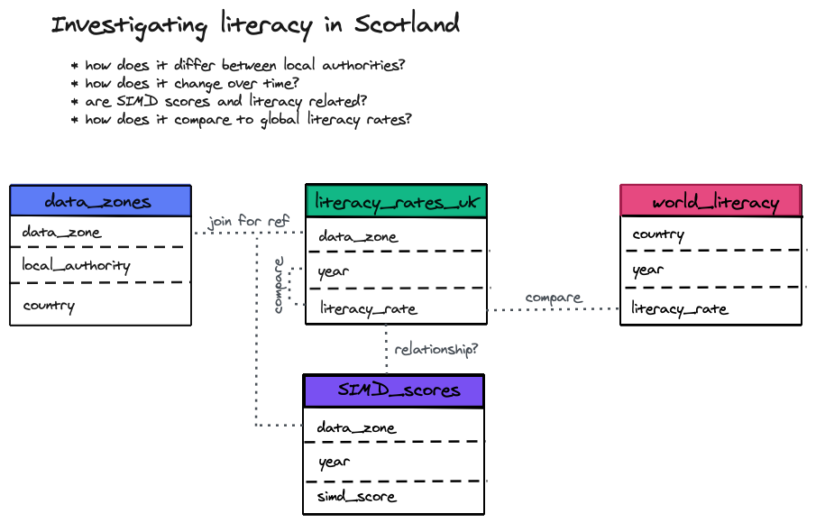

# Data Requriments

If you are doing the PDA then there is a few extra requirements for the project to be aware of. This is because there are specific standards about the type of data that need to be used to meet PDA criteria 

The data you use in the project has to meet the following criteria:

- At least 5,000 rows
- At least 3 sources of data
- Must contain text data, numeric data and dates

Most of the data supplied with the briefs do meet the requirements, but we recommend that you personally make sure that you are indeed meeting these criteria. If your current datasets do not, you are more than welcome to supplement your analysis with further datasets that would help you meet the requirements.

# Work requirements

If you are doing the PDA there are four additional pieces of work you will need to do, aside from the actual project. Don't worry - most of these won't take too long!

1. Before you start your project you must fill out an analysis plan. The questions you will need to answer in this plan are listed in the next section.

2. You will have to produce a clean .Rmd document that describes your analysis. Hopefully you would be doing this anyway! This .Rmd file should contain:
	-	Code that cleans your data.
	-	Code that analyses your data.
	-	Documentation that matches the analysis of your data.
	
3. You must ask for advice from someone more knowledgeable about the project than yourself. This can be one of the instructors, or the client. Or you could even find someone else to discuss the project with.

4. You must spend 10 minutes talking through your analysis with an instructor 1-1 after the project. This is mostly to verify that the analysis is your own work.

## Analysis plan questions

1. Please describe your plan for your analysis. Include details such as:

	-	Where you plan to get your data from?
	-	Summarise the requirements of the project.
	-	What parts of the data are you planning to look at?
	-	How will you ensure your analysis can be shared appropriately when finished? 

2. What potential data quality issues might this data have?

3. What issues with bias might this data have?
 
4. Describe the structure of the data you have. 
	-	How are your data sets related to each other?
	-	How will you combine them to carry out your analysis.
	- Create a data model diagram that shows how your datasets and variables are related to each other. Below is an example of a very simple data model diagram.
	
	
    - **Note:** We've included more examples of data models in the *images* folder since this is not something we've covered in the course. We also have more materials to hand out if anyone wants to learn more about data modelling. Also note that data modelling is a completely different thing from the statistical modelling that we've been doing.

# Marking Scheme

Take a look through the marking scheme below. To pass we must be able to tick every box in the marking scheme. If your project fails on any of these, you will be asked to make changes to the project and resubmit.

## Before project

**1. Planning**

-	A plan has been written.
-	The plan contains business requirements.
-	The plan contains data management.

**2. Data quality and bias**

-	Reasonable consideration of data quality issues.
-	Reasonable consideration of bias issues.

**3. Data modelling**

-	Accurate description of the data model. 

## After project

**4. Analysis Upload**

-	Have used a valid data set (at least 5,000 records, 3 different sources, includes dates, text, and numeric data)
-	Complex transformations of the data carried out.
-	Analysis includes statistical summaries.
-	Analysis identifies all significant relationships in the data.
-	Documentation which describes the analysis included.

**5. Domain expert collaboration**

-	Evidence of collaboration with domain experts.

**6. Authentication of analysis.**

A 5 to 10 minute session with the student where the instructor and the student look at the .Rmd file submitted. Either in person or via online screensharing. 

-	Can the student describe the overall structure of the file.
-	Pick one piece of code: can the student describe what this code does?
-	Pick one piece of analysis: can the student explain how this result was found?

